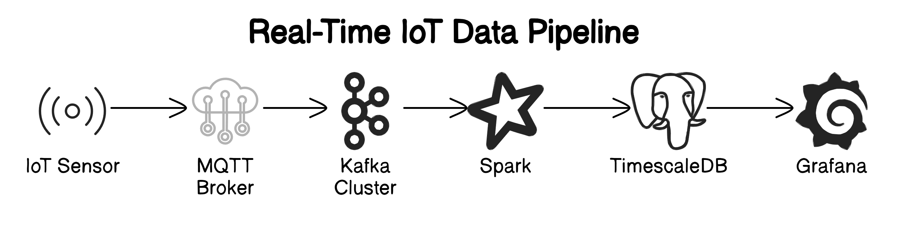

# IoT Sensor Data Pipeline

This project showcases a real-time data pipeline for IoT sensor data, demonstrating the flow of data from MQTT to TimescaleDB through Kafka and Spark. The architecture includes multiple components working together to simulate and visualize the sensor data in a dashboard.



## Architecture Overview

The data flow of this project is as follows:

1. **IoT Sensor Messages Producer**: A Python application that simulates sending sensor data into an MQTT topic called `sensor-data`.
2. **IoT MQTT to Kafka**: An application that forwards data from the MQTT topic into a Kafka topic named `iot-sensor-data`.
3. **Spark Application**: Processes the data from the Kafka topic and sends it to a TimescaleDB table for storage.
4. **Deployment**: All components are deployed as an umbrella Helm chart. The following components are included:
   - **Dependent Charts**:
     - EMQX: MQTT broker for managing sensor data.
     - Grafana: Dashboard for visualizing the data.
     - Spark Operator: Manages Spark applications on Kubernetes.
     - Strimzi Kafka: Manages Kafka clusters and topics.
     - TimescaleDB: A time-series database for storing sensor data.
   - **Kubernetes Deployments**:
     - `sensor-data-producer`: Deployment for the IoT sensor message producer.
     - `mqtt-to-kafka`: Deployment for the application that forwards data from MQTT to Kafka.
     - `spark-kafka-timescaledb`: Deployment for the Spark application that processes data.
     - Grafana dashboard: Visualization of the data stored in TimescaleDB.
     - Kafka cluster and topics: Managed as part of the chart.
5. **Continuous Integration (CI)**: A simple CI job is set up to build the Docker images for the applications.

## Components

### 1. IoT Sensor Messages Producer

- **Language**: Python
- **Function**: Simulates sending sensor data (temperature and humidity) into the MQTT topic.

### 2. IoT MQTT to Kafka

- **Language**: Python
- **Function**: Forwards sensor data from the MQTT topic to the Kafka topic.

### 3. Spark Application

- **Language**: Python
- **Function**: Consumes data from the Kafka topic, processes it, and writes it to TimescaleDB.


## Getting Started

### Prerequisites

- Kubernetes cluster (Minikube, EKS, GKE, etc.)
- Helm installed

### Deployment

1. **Clone the repository**:
   ```bash
   git clone <repository-url>
   cd <repository-directory>
   cd to deploy directory

2. **Deploy suing helm**:
   helm upgrade iot-app ./iot-sensor-app -n iot-app --install --create-namespace```

3. Wait until all pods are in a running state
   ```
    init-sensordata-db-2c5lm                                   0/1     Completed   0             14m
    iot-app-emqx-0                                             1/1     Running     0             19m
    iot-app-grafana-5fdf85886f-s4tp4                           2/2     Running     0             19m
    iot-app-kafka-ui-784fbf7679-f4q55                          1/1     Running     0             19m
    iot-app-spark-operator-fb4d66969-qqzlr                     1/1     Running     0             19m
    iotsensordatakafkatotimesscaledb-92ba519239f73394-exec-1   1/1     Running     0             13m
    matt-to-kafka-6689494b6d-7tnr8                             1/1     Running     6 (15m ago)   19m
    my-cluster-dual-role-0                                     1/1     Running     0             13m
    my-cluster-entity-operator-588964b54f-lqpqg                2/2     Running     0             13m
    sensor-data-producer-7d69c755c5-9wblg                      1/1     Running     0             19m
    spark-kafka-to-timescaledb-driver                          1/1     Running     0             19m
    strimzi-cluster-operator-68b869f585-9b6wm                  1/1     Running     0             19m
    timescaledb-0                                              1/1     Running     0             17m
    ```

## Verify
### Verify EMQX clients "producer and consumer"
Expose EMQX using port-forward, open the it via localhost:8082
enter user as admin and password as public

```kubectl -n iot-app port-forward svc/iot-app-emqx 8082:18083```


### Verify MQTT messages forwarding to Kafka topic: 

verify Kafka is receiving messages in topic "ios-sensor-data" 

Expose Kafka-UI using port-forward, open the it via localhost:8080

```kubectl -n iot-app port-forward svc/iot-app-kafka-ui 8080:80```


### Verify Spark application: 

Verify spark application is running and fetching the data from kafka and sending the data in micro batches to TimeScaleDB.

Expose Spark driver UI using port-forward, open the it via localhost:8085

```kubectl -n iot-app port-forward svc/spark-kafka-to-timescaledb-ui-svc 8085:4040```


### Verify Grafana Dashboard

If all the above is working fine then data is stored in TimeScaleDB table and grafana dashboard will show the data

Expose Grafana using port-forward, open the it via localhost:8081

```kubectl -n iot-app port-forward svc/iot-app-grafana 8081:80```


